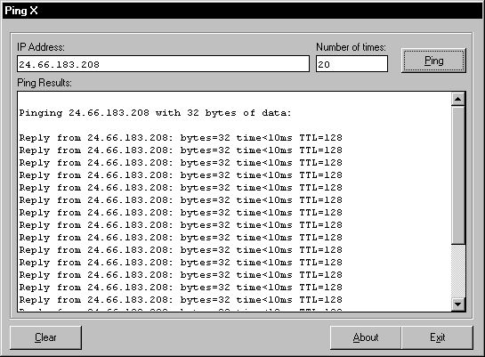



## Ping X

### Description

Ping(s) a computer and returns the results.
 
### More Info
 
IP address is required and the number or times to Ping the IP address.

You need the have Service Pack 4 for Visual Basic 6 (or Visual Studio 6) because this application requires the latest richtextbox control and the latest windows common controls ocx.

Returns result for the Ping command with the time it has taken for each signal to be sent there and back.

None at the moment.

             |
---                |---
**Submitted On**   |2000-10-16 16:40:52
**By**             |[Juri Aksenov](https://github.com/Planet-Source-Code/PSCIndex/blob/master/ByAuthor/juri-aksenov.md)
**Level**          |Intermediate
**User Rating**    |4.7 (33 globes from 7 users)
**Compatibility**  |VB 6\.0
**Category**       |[Complete Applications](https://github.com/Planet-Source-Code/PSCIndex/blob/master/ByCategory/complete-applications__1-27.md)
**World**          |[Visual Basic](https://github.com/Planet-Source-Code/PSCIndex/blob/master/ByWorld/visual-basic.md)
**Archive File**   |[CODE\_UPLOAD1070010162000\.zip](https://github.com/Planet-Source-Code/juri-aksenov-ping-x__1-12094/archive/master.zip)

### API Declarations

All included in Zip file.

